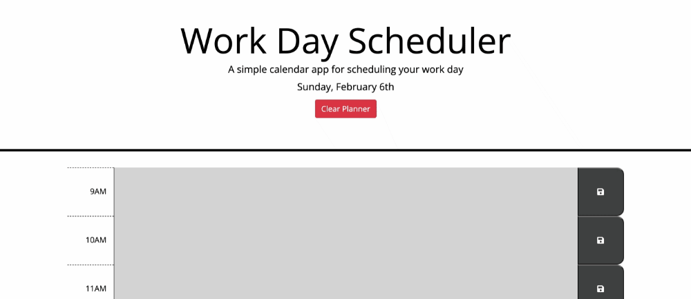

# Week5-Homework

# Work-day-scheduler

## Description 

This is a simple website to plan out your working day.
On  load of page the current day is displayed.
Past hours show up in grey, present in red and future in green.
When data if entered and the save button is clicked then the data will remain even through page loads.
With the addition of a clear data button which will remove all data for the day.

## Technologies Used

- Javascript
- CSS
- HTML

## Screenshot 

## Resources 

**https://mckayjalex.github.io/Work-day-scheduler/**

## Contact Information

Mobile: 0436 857 403  
Email: alexjosephmckay@gmail.com  
GitHub: **https://github.com/mckayjalex**  
Linkin: **https://www.linkedin.com/in/alex-mckayy**

## License 

MIT License

Copyright (c) [2022] [Alex McKay]

Permission is hereby granted, free of charge, to any person obtaining a copy
of this software and associated documentation files (the "Software"), to deal
in the Software without restriction, including without limitation the rights
to use, copy, modify, merge, publish, distribute, sublicense, and/or sell
copies of the Software, and to permit persons to whom the Software is
furnished to do so, subject to the following conditions:

The above copyright notice and this permission notice shall be included in all
copies or substantial portions of the Software.

THE SOFTWARE IS PROVIDED "AS IS", WITHOUT WARRANTY OF ANY KIND, EXPRESS OR
IMPLIED, INCLUDING BUT NOT LIMITED TO THE WARRANTIES OF MERCHANTABILITY,
FITNESS FOR A PARTICULAR PURPOSE AND NONINFRINGEMENT. IN NO EVENT SHALL THE
AUTHORS OR COPYRIGHT HOLDERS BE LIABLE FOR ANY CLAIM, DAMAGES OR OTHER
LIABILITY, WHETHER IN AN ACTION OF CONTRACT, TORT OR OTHERWISE, ARISING FROM,
OUT OF OR IN CONNECTION WITH THE SOFTWARE OR THE USE OR OTHER DEALINGS IN THE
SOFTWARE.

