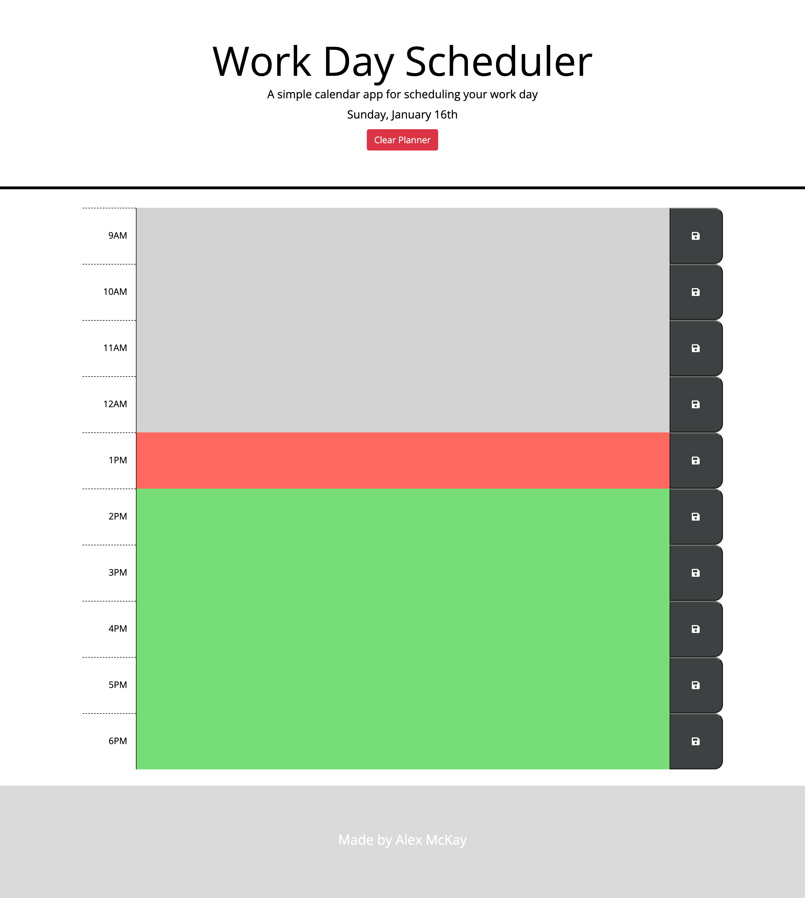

# Week5-Homework

# Work-day-scheduler

## Description 

This is a simple website to plan out your working day.
On  load of page the current day is displayed.
Past hours show up in grey, present in red and future in green.
When data if entered and the save button is clicked then the data will remain even through page loads.
With the addition of a clear data button which will remove all data for the day.

## Screenshot 

## Resources 

**https://mckayjalex.github.io/Work-day-scheduler/**

